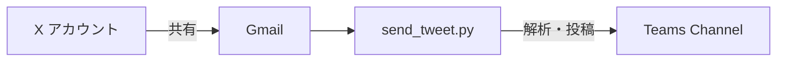

# X共有メール → Teams投稿機能の実装計画

## 概要
Xアカウントから共有したポストをGmail経由でMicrosoft Teamsに自動投稿するシステムを構築します。

## システムフロー



1. ユーザーがXで気になるポストを自分のGmailアドレス（example@gmail.com）に共有
2. `send_tweet.py`が定期的にGmailをチェック
3. X共有メールを検出・解析
4. Teams Channelに整形して投稿

## 実装詳細

### 1. ディレクトリ構造

```
/workspace/NewsBot/
├── app/
│   ├── send_tweet.py        # X共有メール処理スクリプト
│   ├── credentials/         # Gmail認証情報格納ディレクトリ
│   │   ├── credentials.json # OAuth2クライアントシークレット
│   │   └── token.json       # アクセストークン（自動生成）
│   └── util/
│       └── log.py           # 既存のログユーティリティ
├── doc/
│   └── plan.md              # 本計画書
└── conf/
    └── docker-compose-dev.yml # Docker設定
```

### 2. Gmail API設定

#### 必要な認証設定（詳細手順）

##### Step 1: Google Cloud Consoleでプロジェクト作成
1. [Google Cloud Console](https://console.cloud.google.com/)にアクセス
2. 「プロジェクトを選択」→「新しいプロジェクト」をクリック
3. プロジェクト名を入力（例：`newsbot-gmail`）
4. 「作成」をクリック

##### Step 2: Gmail APIを有効化
1. 作成したプロジェクトを選択
2. 左メニューから「APIとサービス」→「ライブラリ」を選択
3. 検索バーに「Gmail API」と入力
4. 「Gmail API」を選択し「有効にする」をクリック

##### Step 3: OAuth 2.0認証情報の作成
1. 「APIとサービス」→「認証情報」を選択
2. 「+ 認証情報を作成」→「OAuth クライアント ID」を選択
3. 初回の場合「同意画面を構成」が必要：
   - ユーザータイプ：「外部」を選択
   - アプリ名：`NewsBot Gmail Reader`
   - サポートメール：自分のGmailアドレス
   - スコープ追加：
     - `https://www.googleapis.com/auth/gmail.readonly`
     - `https://www.googleapis.com/auth/gmail.modify`
4. OAuthクライアントIDの作成：
   - [OAtuh クライアントの作成] を選択
   - アプリケーションの種類：「デスクトップアプリ」
   - 名前：`NewsBot Client`
   - 「作成」をクリック
5. [APIとサービス][OAuth同意画面][対象][テストユーザー][＋Add users]

##### Step 4: credentials.jsonのダウンロードと配置
1. 作成されたクライアントIDの右側「ダウンロード」アイコンをクリック
2. ダウンロードしたJSONファイルを`credentials.json`にリネーム
3. 以下のディレクトリに配置：
   ```bash
   mkdir -p /workspace/NewsBot2/app/credentials/
   mv ~/Downloads/credentials.json /workspace/NewsBot2/app/credentials/
   chmod 600 /workspace/NewsBot2/app/credentials/credentials.json
   ```

##### Step 5: 初回認証とtoken.pickleの生成
1. ローカル環境で初回実行：
   ```bash
   cd /workspace/NewsBot2
   python app/send_tweet.py
   ```
2. ブラウザが自動で開く → Googleアカウントでログイン
3. 「このアプリは確認されていません」→「詳細」→「NewsBot Gmail Reader（安全ではないページ）に移動」
4. 権限を許可：
   - Gmailのメールメッセージの表示
   - Gmailのメールメッセージの変更
5. 認証成功後、`token.pickle`が自動生成される：
   ```
   /workspace/NewsBot2/app/credentials/token.pickle
   ```

#### ファイル説明
- **credentials.json**: OAuth 2.0クライアントシークレット（Google Cloudからダウンロード）
- **token.pickle**: アクセストークン（初回認証時に自動生成、リフレッシュトークン含む）

#### スコープ
- `https://www.googleapis.com/auth/gmail.readonly` - メール読み取り
- `https://www.googleapis.com/auth/gmail.modify` - メールのラベル変更（既読マーク）

#### セキュリティ注意事項
- `credentials.json`と`token.pickle`は**絶対にGitにコミットしない**
- `.gitignore`に必ず追加：
  ```gitignore
  app/credentials/
  *.pickle
  credentials.json
  ```
- 本番環境では環境変数やシークレット管理サービスを使用

### 3. send_tweet.py の主要コンポーネント

#### 3.1 GmailClient クラス
```python
class GmailClient:
    """Gmail API クライアント"""
    def __init__(self, credentials_path: str, token_path: str)
    def authenticate(self) -> None
    def get_unread_emails(self, sender: str, subject_pattern: str) -> List[Dict]
    def mark_as_read(self, email_id: str) -> None
    def extract_x_post_info(self, email_content: str) -> Dict
```

#### 3.2 XPostParser クラス
```python
class XPostParser:
    """X共有メールの解析"""
    def __init__(self)
    def is_x_share_email(self, email: Dict) -> bool
    def extract_post_url(self, content: str) -> str
    def extract_post_content(self, content: str) -> Dict
```

#### 3.3 TeamsXPostPublisher クラス
```python
class TeamsXPostPublisher:
    """X投稿をTeamsに投稿"""
    def __init__(self, webhook_url: str)
    def create_x_post_card(self, post_info: Dict) -> Dict
    def publish_x_posts(self, posts: List[Dict]) -> int
```

### 4. 環境変数設定

新規追加する環境変数：
```bash
# Gmail API設定
GMAIL_CREDENTIALS_PATH=/app/app/credentials/credentials.json
GMAIL_TOKEN_PATH=/app/app/credentials/token.json
GMAIL_ADDRESS=example@gmail.com

# メールチェック設定
GMAIL_CHECK_INTERVAL=5  # 分単位
MAX_EMAILS_PER_CHECK=10  # 1回のチェックで処理する最大メール数

# X共有メール識別パターン
X_SHARE_SUBJECT_PATTERN=".*x\.com.*|.*twitter\.com.*"
```

### 5. X共有メールの識別ロジック

#### 識別条件
1. 送信者と受信者が同一（example@gmail.com）
2. 件名または本文にX/Twitterのリンクを含む
3. 特定のメールヘッダーパターン

#### 抽出する情報
- ポストURL
- ポスト作成者（@ユーザー名）
- ポスト本文（可能な場合）
- 共有日時
- 元のポスト投稿日時（可能な場合）

### 6. Teams投稿フォーマット

Adaptive Cardフォーマット例：
```json
{
  "type": "AdaptiveCard",
  "version": "1.2",
  "body": [
    {
      "type": "TextBlock",
      "text": "🐦 X Post Share",
      "size": "Large",
      "weight": "Bolder"
    },
    {
      "type": "TextBlock",
      "text": "[ポスト本文]",
      "wrap": true
    },
    {
      "type": "FactSet",
      "facts": [
        {"title": "投稿者", "value": "@username"},
        {"title": "共有日時", "value": "2024-09-21 10:30"}
      ]
    }
  ],
  "actions": [
    {
      "type": "Action.OpenUrl",
      "title": "Xで開く",
      "url": "[ポストURL]"
    }
  ]
}
```

### 7. エラーハンドリング

#### 想定されるエラーと対処
1. **Gmail API認証エラー**
   - トークンの再生成を試行
   - エラーログ記録、管理者通知

2. **メール解析エラー**
   - スキップして次のメールを処理
   - エラーパターンをログに記録

3. **Teams投稿エラー**
   - リトライ機構（最大3回）
   - 失敗したメールは未読のまま残す

### 8. Docker設定更新

`docker-compose-dev.yml`への追加：
```yaml
labels:
  # 既存のジョブ
  ofelia.job-exec.newsbot.schedule: "@every 1m"
  ofelia.job-exec.newsbot.command: "python /app/app/send_news.py"

  # 新規追加：X共有メール処理ジョブ
  ofelia.job-exec.xshare.schedule: "@every 5m"
  ofelia.job-exec.xshare.command: "python /app/app/send_tweet.py"
```

### 9. セキュリティ考慮事項

1. **認証情報の保護**
   - credentials.jsonは.gitignoreに追加
   - token.jsonは自動生成、.gitignoreに追加
   - 本番環境ではシークレット管理サービス使用推奨

2. **アクセス制限**
   - Gmail APIは読み取りと既読マークのみ
   - 削除権限は付与しない

3. **レート制限**
   - Gmail API: 250 quota units/秒
   - Teams Webhook: 要確認

### 10. テスト計画

#### 単体テスト
- GmailClient: モックを使用したAPI呼び出しテスト
- XPostParser: 各種メールフォーマットの解析テスト
- TeamsXPostPublisher: カード生成テスト

#### 統合テスト
1. テスト用Gmailアカウントでの動作確認
2. 各種X投稿形式（テキスト、画像、リンク）の処理確認
3. エラーケースの処理確認

### 11. 今後の拡張案

1. **フィルタリング機能**
   - 特定のキーワードを含む投稿のみ転送
   - 特定のユーザーからの投稿を優先

2. **リッチコンテンツ対応**
   - 画像・動画のサムネイル表示
   - スレッドの展開表示

3. **双方向連携**
   - TeamsからXへの返信機能
   - リアクション同期

## 実装スケジュール

1. **Phase 1: 基本実装**（現在）
   - Gmail API連携
   - 基本的なメール解析
   - シンプルなTeams投稿

2. **Phase 2: 機能拡張**
   - エラーハンドリング強化
   - リッチコンテンツ対応

3. **Phase 3: 運用最適化**
   - パフォーマンス改善
   - 監視・アラート機能

## 参考資料

- [Gmail API Python Quickstart](https://developers.google.com/gmail/api/quickstart/python)
- [Microsoft Teams Adaptive Cards](https://docs.microsoft.com/en-us/adaptive-cards/)
- [X Developer Documentation](https://developer.twitter.com/en/docs)